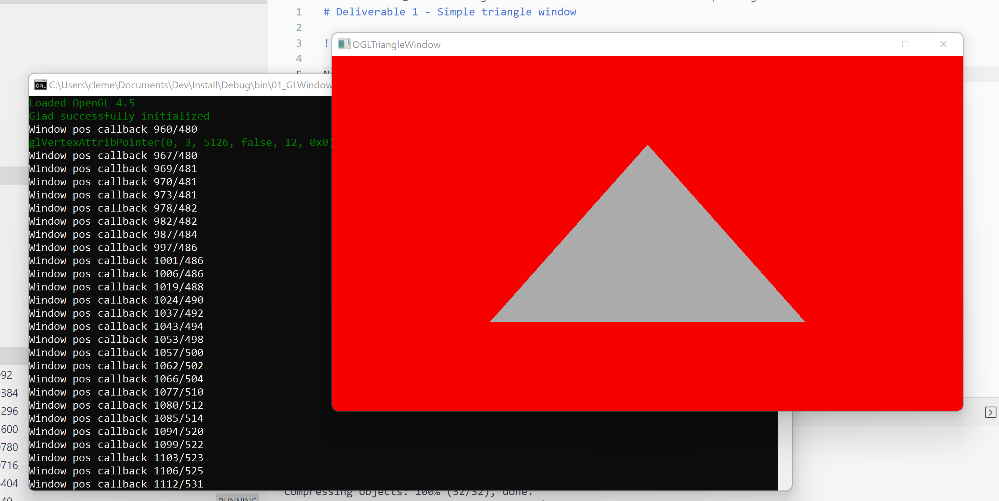

# Deliverable 1 - Simple triangle window

Not really a deliverable for clients, but the first pass to organize the project.

Features:
- OpenGL raw classes
- Application / WindowsManager classes
- Application main loop
- Logging using macros
- Basic support for multiple windows

Libraries:

- OpenGL is loaded with *glad*
- Windows are created using *glfw*
- Logging uses *fmt*

Shortcomings:
- Haven't implemented window resize callback
